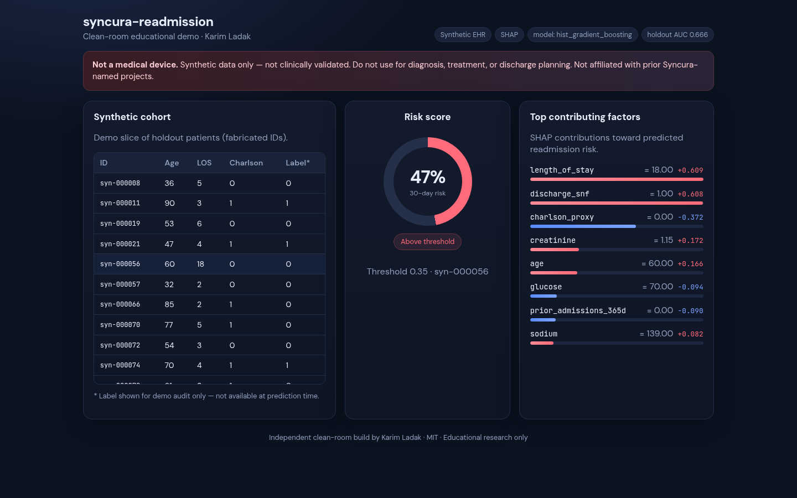

# syncura-readmission

**Clean-room educational demo** of interpretable 30-day readmission risk on **synthetic** EHR-like tabular data — SHAP explanations, FastAPI, and a small clinician-facing dashboard.

**Owner:** [Karim Ladak](https://github.com/kladak) (`kladak`)



Local Vite + FastAPI screenshot (2026-09-14): holdout patient `syn-000056`, HistGradientBoosting risk **47%** (above 0.35 threshold), TreeExplainer SHAP factors (`length_of_stay`, `discharge_snf`, …). **Not a medical device.** Synthetic data only — not clinically validated.

## Demo

1. Bootstrap data + model (see [Run Locally](#run-locally)).
2. Start the API, then the Vite dashboard.
3. Open `http://localhost:5173`.
4. Read the disclaimer banner (synthetic / not a medical device).
5. Click a holdout patient in **Synthetic cohort**.
6. **Risk score** shows 30-day probability vs threshold; **Top contributing factors** are SHAP values from TreeExplainer on the trained HGB model.

Labels in the cohort table are for demo audit only — they are not available at prediction time.

## Results

After training, metrics are written to `models/metrics.json`. Example run (seed=42, n=4000):

| Metric (HGB primary, seed=42, n=4000) | Value |
|--------|-------|
| ROC-AUC | 0.666 |
| PR-AUC | 0.398 |
| Brier | 0.189 |
| Logistic ROC-AUC (baseline) | 0.671 |

These numbers describe **synthetic** signal only — they are not clinical performance. Logistic sometimes edges ROC-AUC on this draw; HGB is primary because TreeExplainer is the dashboard explanation path.

## Run Locally

### 1. Python env

```bash
python -m venv .venv
source .venv/bin/activate
pip install -r requirements.txt
```

### 2. Generate data & train

```bash
python -m src.syncura.data.generate --out data --n-patients 4000 --seed 42
python -m src.syncura.model.train --data data --out models --seed 42
# or: ./scripts/bootstrap.sh
```

### 3. API

```bash
uvicorn src.syncura.api.main:app --reload --port 8000
```

- `GET /health`
- `GET /patients?limit=40` — synthetic holdout slice
- `GET /metrics`
- `POST /predict` — `{ "features": { ... } }` or `{ "patient_id": "syn-000123" }`
- `POST /explain` — same body; returns top SHAP factors

If port 8000 is taken:

```bash
uvicorn src.syncura.api.main:app --reload --port 8040
SYNCURA_API_URL=http://127.0.0.1:8040 npm run dev   # from frontend/
```

### 4. Dashboard

```bash
cd frontend
npm install
npm run dev
```

Open the Vite URL (default `http://localhost:5173`). The UI proxies `/api` → `http://localhost:8000` (override with `SYNCURA_API_URL`).

### Docker (optional)

```bash
docker compose up --build
```

API: `http://localhost:8000` · UI: `http://localhost:5173` (or mapped port in compose).

## Scope & honesty

Clean-room educational implementation using synthetic data. Reported metrics apply only to the included synthetic benchmark. **Not a medical device.** Not clinically validated. Do not use for care decisions.

See [`PROVENANCE.md`](PROVENANCE.md) for independent-implementation notes.

## What's inside

| Piece | Stack |
|-------|--------|
| Synthetic EHR generator | pandas / numpy |
| Model | scikit-learn HistGradientBoosting (+ logistic baseline) |
| Explanations | SHAP (TreeExplainer) |
| API | FastAPI |
| UI | Vite + React |
| Tests / CI | pytest + GitHub Actions |

## Project layout

```
SPEC.md
README.md
requirements.txt
src/syncura/
  data/generate.py
  model/train.py
  model/explain.py
  api/main.py
frontend/          # Vite React app
tests/
.github/workflows/ci.yml
docker-compose.yml
```

## License

MIT — educational use. No warranty. Not for clinical deployment.
